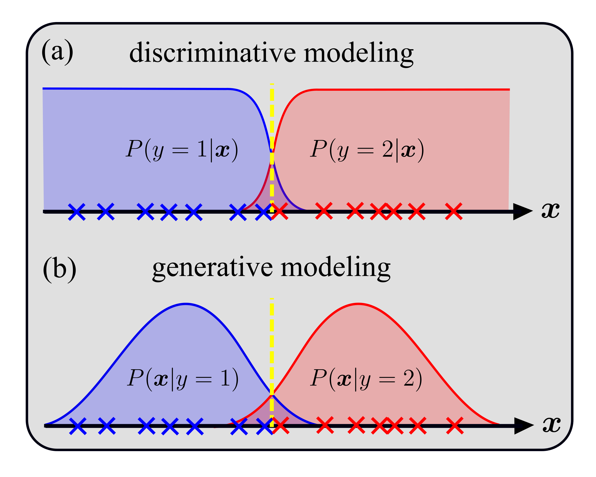

# Mapping out phase diagrams with generative classifiers
This repository contains a Julia implementation of the generative approach to phase-classification tasks introduced in our
[paper](https://arxiv.org/abs/2306.14894).

### Abstract of the paper
One of the central tasks in many-body physics is the determination of phase diagrams, which can be cast as a classification problem. Typically, classification problems are tackled using discriminative classifiers that explicitly model the conditional probability of labels given a sample. Here we show that phase-classification problems are naturally suitable to be solved using generative classifiers that are based on probabilistic models of the measurement statistics underlying the physical system. Such a generative approach benefits from modeling concepts native to the realm of statistical and quantum physics, as well as recent advances in machine learning. This yields a powerful framework for mapping out phase diagrams of classical and quantum systems in an automated fashion capable of leveraging prior system knowledge.

<p align="center">

</p>

### This repository

contains code to map out phase diagrams given generative models. The source files can be found in [source folder](./src/). We provide exemplary code for

* the equilibrium phase diagram of the two-dimensional anisotropic Ising model (L=20), see [this folder](./examples/Ising/),

* and the ground-state phase diagram of the cluster-Ising model (L=7), see [this folder](./examples/Cluster-Ising/).

The corresponding data can be found in the [data folder](./data/) (large files need to be unzipped). Additional data is available upon request. Other physical systems can be analyzed in the same fashion by replacing the corresponding generative models.

### How to run / prerequisites:

- install [julia](https://julialang.org/downloads/)
- download, `activate`, and `instantiate` [`Pkg.instantiate()`] our package
- individual files can then be executed by calling, e.g., `julia run_main_2D.jl`
- uncomment `savefig()` functions to save plots

## Authors:

- [Julian Arnold](https://arnoldjulian.github.io/)
- [Frank Schäfer](https://frankschae.github.io/)
- [Alan Edelman](https://math.mit.edu/~edelman/)
- [Christoph Bruder](https://quantumtheory-bruder.physik.unibas.ch/en/people/group-members/christoph-bruder/)

```
@article{arnold:2023,
  title={Mapping out phase diagrams with generative classifiers},
  author={Arnold, Julian and Schäfer, Frank and Edelman, Alan and Bruder, Christoph},
  journal={arXiv:2306.14894},
  year={2023},
  url = {https://arxiv.org/abs/2306.14894}
}
```
